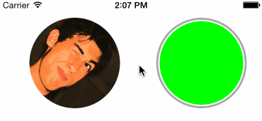
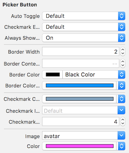

# RCPickerButton

Simple button for marking items as selected. You can use it for select user by avatar or something else. You can customise RCPickerButton as you want: change borders, always show it, disable checkmark.

RCPickerButton fully support Interface Builder. You can customise it from IB and nothing to code.

## Installation

### CocoaPods

Add `pod 'RCPickerButton'` to your Podfile. 

### Manual Installation

Just copy `RCPickerButton` class to your project.

## Requirements

- Xcode 7.0
- iOS 8.0+

## License

RCPickerButton is available under the MIT license. See the LICENSE file for more info.